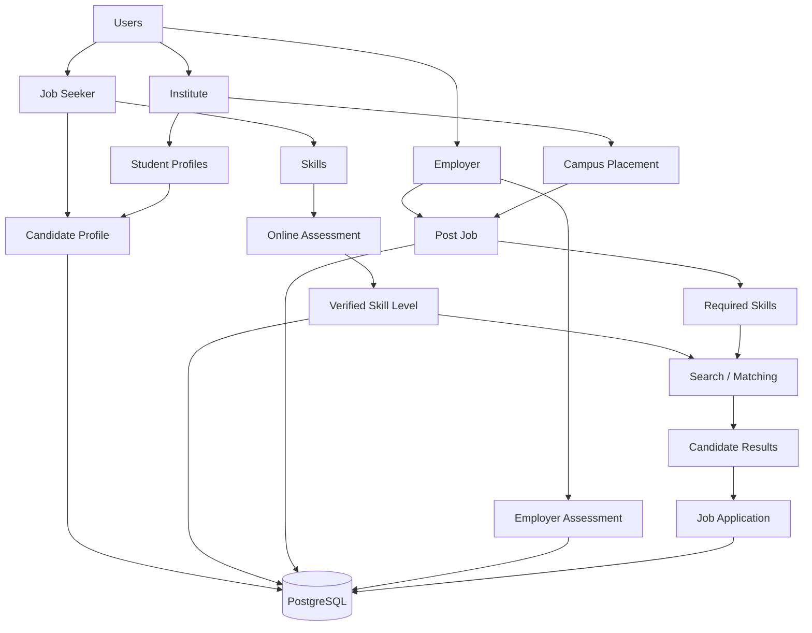

## Architecture

```mermaid
flowchart TB

    U["Users"]

    U --> JS["Job Seeker"]
    U --> E["Employer"]
    U --> I["Institute"]

    %% Job Seeker
    JS --> P["Candidate Profile"]
    JS --> S["Skills"]
    S --> A["Online Assessment"]
    A --> V["Verified Skill Level"]

    %% Employer
    E --> J["Post Job"]
    J --> R["Required Skills"]
    E --> OA["Employer Assessment"]

    %% Matching
    V --> M["Search / Matching"]
    R --> M
    M --> C["Candidate Results"]
    C --> AP["Job Application"]

    %% Institute
    I --> ST["Student Profiles"]
    I --> CP["Campus Placement"]
    ST --> P
    CP --> J

    %% Database
    P --> DB[("PostgreSQL")]
    V --> DB
    J --> DB
    OA --> DB
    AP --> DB
```

## Schema Design

DB schema : [Eraser.io](https://app.eraser.io/workspace/c9tWyi1eJw090g3xfxnQ)