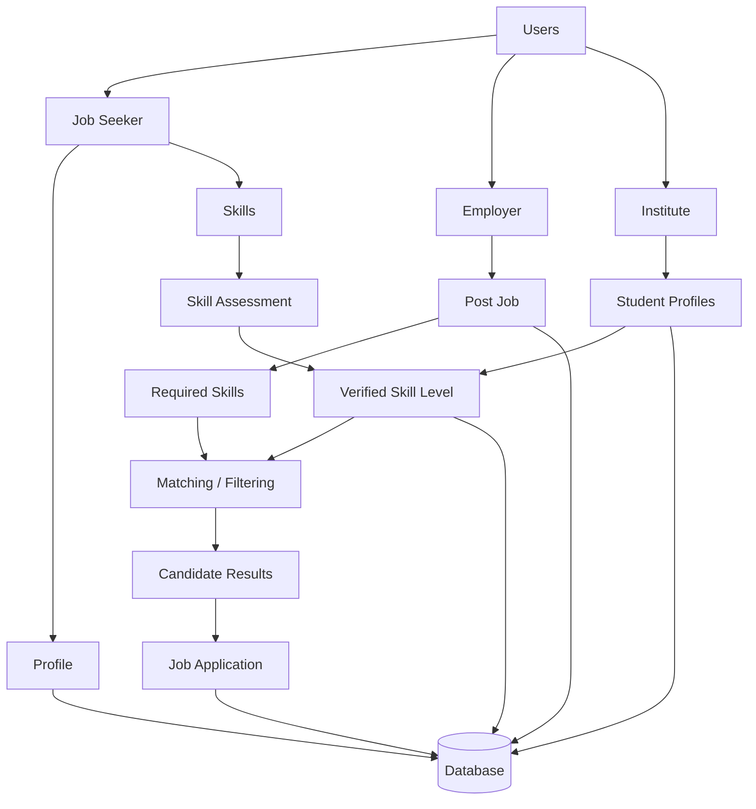

# <b>TALENT GRID</b>

A web platform focused on jobs accross nation, it helps the individuals to explore jobs in different niche accordingly.

## Key Features 

- ❌Filter out spam candidates.
- OA based skills on user profile which give an authencity either they are verifid or not.

### Job Seekers

- Candidate explore jobs nationally.
- Provides a feature of campus placement drive for students along with the accessibility to find jobs off campus.

### Organization 

- Conduct a initial assignment/OA on platform to filter out the candidates.
- Explore candidate on the basic of the skills set.

## Architecture

## Tools and Technologies 

- React & tailwind (for frontend) and vercel for hosting
- Express (for backend)
- PostgreSQL (for database) and Supabase for hosting
- Python (for OA)
    

