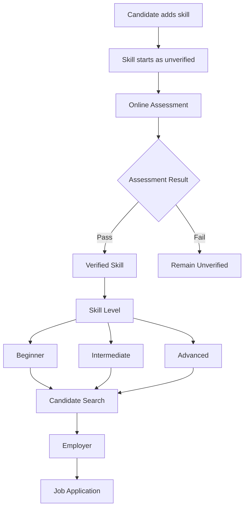

# TALENT GRID

A web platform that connects **job seekers, employers, and educational institutes** through skill-based hiring and verified candidate profiles.

TalentGrid allows candidates to discover jobs across the country, build skill-based profiles, and verify their skills through online assessments. Employers can define required skills, conduct assessments, and discover candidates based on their verified skill levels.

## Key Features

* **Skill Verification** — Candidates can take online assessments to verify their claimed skills.
* **Skill-Based Profiles** — Candidate profiles display verified and unverified skills along with their proficiency levels.
* **Job Search** — Job seekers can explore job opportunities across different domains and locations.
* **Skill-Based Candidate Search** — Employers can search and filter candidates according to their required skills and proficiency levels.
* **Online Assessments (OA)** — Employers can conduct initial assessments to evaluate candidates.
* **Campus & Off-Campus Opportunities** — Institutes can facilitate campus placement drives while students can also apply for off-campus opportunities.

## Job Seekers

* Create and manage a professional profile.
* Add skills to their profile.
* Take online assessments to verify their skills.
* Progress through skill levels such as **Beginner, Intermediate, and Advanced**.
* Explore jobs based on skills and preferences.
* Apply for jobs and track applications.
* Access both campus placement and off-campus opportunities.

## Employers / Organizations

* Create an organization profile.
* Post job opportunities.
* Define required skills and minimum proficiency levels.
* Conduct an initial assignment or online assessment.
* Search and filter candidates based on verified skills.
* View candidate profiles and their skill verification status.
* Shortlist candidates for further recruitment.

## Institutes / Colleges

* Create and manage an institute profile.
* Manage participating students.
* Facilitate campus placement drives.
* Help students discover relevant job opportunities.
* Provide academic/student verification where applicable.

## Core Workflow



## Search & Matching

Employers can search candidates using criteria such as:

* Skill
* Minimum skill level
* Verification status
* Location
* Experience

For example:

```text
Job Requirement

Java        → Intermediate
Spring Boot → Beginner
SQL         → Intermediate

                ↓

       Candidate Matching

                ↓

Candidate A → 92% Match
Candidate B → 78% Match
Candidate C → 61% Match
```

The initial implementation will use **PostgreSQL queries and backend matching logic** rather than a dedicated search engine.

## Technology Stack

* **Frontend:** React + Tailwind CSS
* **Frontend Hosting:** Vercel
* **Backend:** Node.js + Express
* **Database:** PostgreSQL + MongoDB
* **Database Hosting:** Supabase + MongoDB Atlas
* **Assessment Engine:** Python

## How to run it

* **client:** npm run dev
* **server:** npm run dev

## Links

* **Architecture Overview :** [overview.md](./docs/architecture/overview.md)